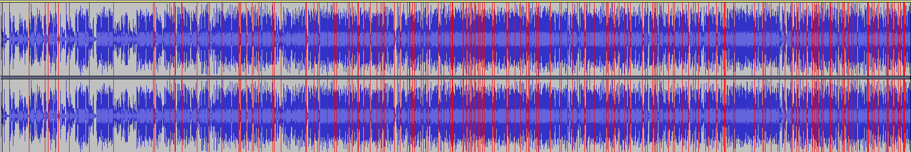
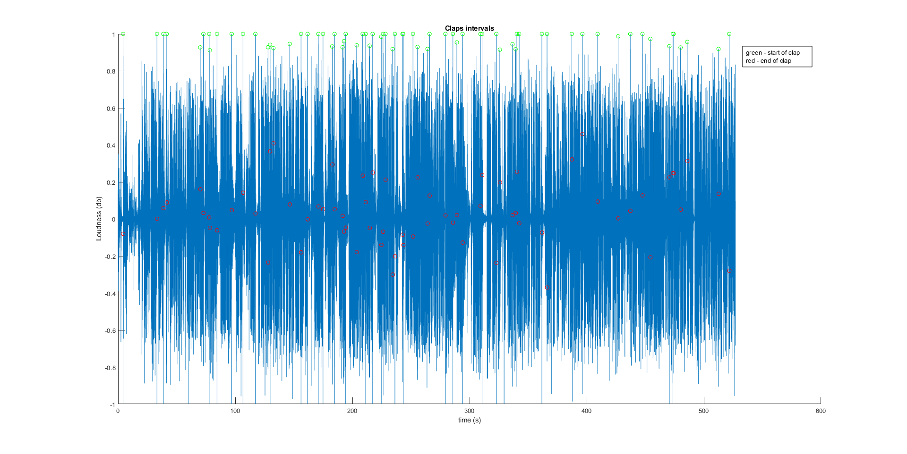
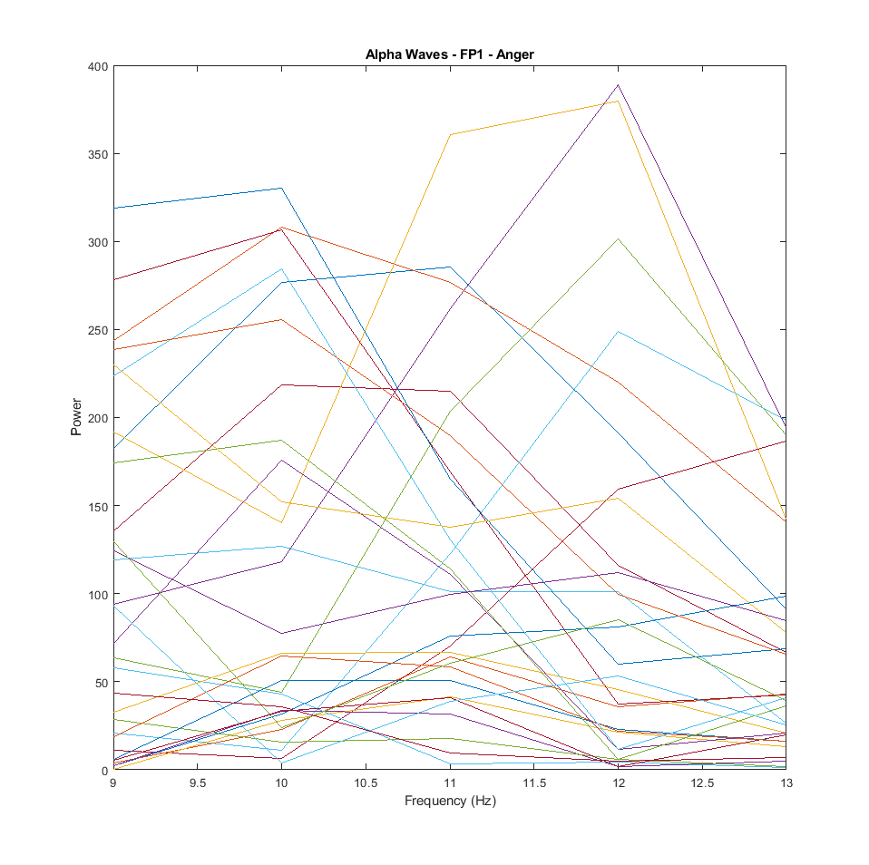
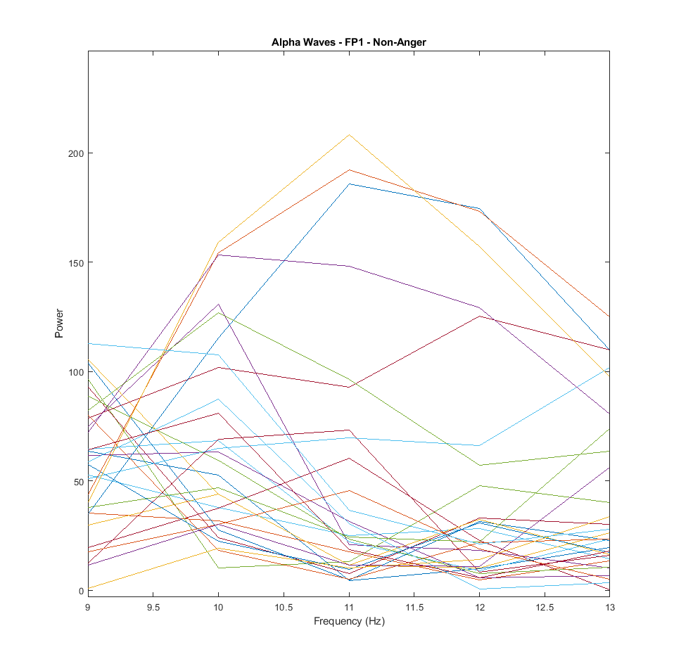

# Bachelor project 

## TODO:
1. Watch 2D.
2. Add 2C / 2D to graphs.
3. Compare experienced vs non-experienced.

## Linear mixed effects model
Two things always need to be done to validify a Linear mixed effects model:
1. Check for normality and homogeneity.
2. You need to construct a so-called “null model” and compare the performance of your mixed model to this null model.
I. Mixed effects models belong to the family of parametric statistical techniques (together with such tests as t-tests and
ANOVAs). Parametric approaches require the difference between the conditions
to be normally distributed, i.e. the differences between condition A and condition
B need to approximate a bell-shaped curve. Non-parametric techniques do not
have this restriction – they are “distribution-free” –, however, mixed models are
parametric and therefore we need to check whether the differences actually follow
the normal curve. Another requirement of mixed models is that the data is
homogenous, namely that one part of your dataset is not vastly different from
another with respect to e.g. variance.

This plot checks for both -> Two clouds are formed depicting differences between male and female.
In our case, we are interested in (hopefully, if there is an effect between experienced and non-experienced) noticing two distinct clouds relating experienced and non-experienced monks.
They are compared in terms of F3-F4, FP1-FP2, and T8-T7 electrode differences for anger moments. **A linear trend must not be present, or any pattern for that matter.** Relatively higher differences should be noticed for beginner monks than for experienced monks. Not only that but the frequency of these differences should be higher in beginner than in experienced monks.
```R
plot(fitted(politeness.model), residuals(politeness.model))
```
This will check the intensity of anger, meaning that higher differences will account for a stronger likelihood that
the anger moment event indicates anger. Bare in mind that ultimately we are interested in seeing whether beginner monks
have more occurrences of anger compared to experienced monks. 

II. We need to check that our model performs significantly better than a 'NULL model'.
A null model is a model that includes only the random effects and not the fixed effects we’re
interested in. You can think of this as a kind of “sanity check” in which we assess
whether our fixed effects have any merit at all. The null model below has a single
fixed effect “1”.
```R
politeness.null = lmer(frequency ~ 1 + (1|subject) + (1|scenario), data=politeness)
```
Then, we perform a so-called likelihood ratio test with the anova()
command. We simply put the test model as one argument and the null model as
the other:
```R
anova(politeness.model, politeness.null)
```
If the likelihood ratio test would not reach significance, you should reject your
results and not report them.

### Method of execution of LME
Due to the fact that the occurrences of anger per debate are scarce, the classifier would be unable to learn from them without risking over-fitting. Over-fitting would occur since the participants in the debates vary randomly in terms of skull-thickness and inter-brain synchronization. As such, instead of treating each debate separately, a continuous mesh of debates is created by concatenating the clean EEG readings of each electrode one after another. The resulting continuous debate should be stored in .csv format for easy R implementation.
OPTION 1: Since inter-brain synchronization may differ between participants, the final reading of the electrode may be different from one debatee to another. To account for this, inter-brain synchronization is treated as a random effect.
OPTION 2: Since there may be individual differences between participants that are out of our control we treat the debate number (equivalent to scenario number from the tutorial) as a random effect.
OPTION 3: Both OPTION 1 and OPTION 2.

Normality, homogeneity, and a null model comparison needs to be created and compared to our model. If there is a significant difference between the two it means that our fixed effects are influencing our model. (our fixed effects being experienced and beginner).


### Combating times
Since we know how many trials each debate has and we know the trial that we want to get from a certain debatee, we need to add to the time that we find the amount of trials that have come before the debate in question. So, if we're intersted in time 10 of debate 2 and debate 1 has 620 trials, then we should investigate trial 630 of the concatenated string of debates.

## Potential Extension
**After** getting non-experienced results of EEG analysis, then maybe take 1 second interval times of interest, so half a trial. Recommendation from teacher as occurrence of anger may dissipate quickly. This works under the assumption that the statement is true and under the assumption that we have accurate times. 

## Extension app
The app would give you an option to choose what type of debate to run investigations on. Based on the times that we have chosen, the app would run an oscillatory power test on the debate at a frequency given by the user. It is an interface that implements the methodology that we have used. If implementing multiple classifiers, an option to train and test different classifiers could be implemented using different portions of the data.
## INSTRUCTIONS

Intersected times of anger / non-anger are in debate_X_times.m / debate_X_times_peace.m. The electrodes and frequency specifications are in elec_freq.m.

1. Activate Fieldtrip by adding its path to your current working directory and running ft_defaults:
```Matlab
addpath('fieldtrip\directory');
ft_defaults;
```
2. Computing the oscillatory power of all sites for a frequency can be done with the function `fieldanalfn(freq, data`).
3. Computing the average power of anger / non-anger conditions can be done with the function `comp('debate_X_times', elec1, elec2, pows)`
The averages are displayed in console. Currently, the `comp()` function gives you the difference between elec1 and elec2 in terms of average power.
4. After computing every average of every debate, the results of the two conditions are put in seperate vectors. Boxplots of the two vectors are created and the p-value is computed.

## Detect average loudness of voice and detect voice above threshold
An automated way in which anger might be detected is by using loudness as an indication of anger. By extracting just the voice of the monk from the audio file and computing how many standard deviations the voice is from the average (z-score) one can have an intuition whether a monk is feeling angry. How many deviations it needs to be is still a matter of discussion.

This is done in a few steps:
### Audio - removal of claps
During the debates monks clap. Claps are a nuiscance since they mess with the average amplitude value of the sound file. They need to be removed in order to get a representative number of the average loudness the monks' voice.
#### Original idea
Claps are very high in amplitude. So much so that they create hardware clippings, meaning that their value is infinite on the db scale (sometimes represented as 0 in the data). The claps can be easily detected by taking the peaks of the data, which are these clippings (marked in red on the spectogram).

A clap, however, although generating a peak, it also generates infinitessimally smaller values compared to the peak near the peak that will not be caught by taking the maximum. A sample interval to the left and to the right of the peak should be taken instead. How large this sample interval needs to be is still up for discussion.

Create vector of values of claps named `claps`.
Create a new vector of original values - the values from `claps`.
The following bit of code is in `n^2` so it is not favorable (takes more than 20 minutes).
```matlab
ismember(index, claps);
```
Better solution is to:
1. Use a pointer that loops through the original array.
2. Check value of pointer == value of pointer in claps array.
3. Increment claps array pointer only when values are true.
4. If the values are false, add in a new vector at a pointer whose value increments only in this if statement the value at the index position.

When computing the average in order to normalize the data and compute its z-score, the clapping values should not be removed since that would shift the EEG data. Better is to give it a value which does not influence the loudness (0 probably but if clippings are also 0 values then we have a problem) and count how many there are. Subtract the number over which you divide by this counter to not count the claps in the average.

#### Comparison between anger and non-anger moments of Channel FP1 for Alpha waves.


